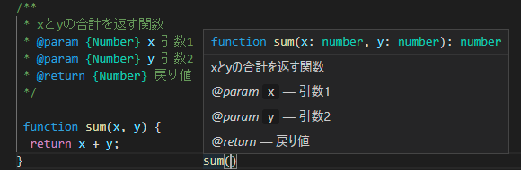

# JSDocについて

調べごとをしていると、たまーに使われていることがあったので、調べてみました。

## JSDocとは

JSDocは、JavaScriptのコードに情報を追加する（アノテーション）ために使われるマークアップ言語のことを言います。主にプログラムのコードの説明をするために使われます。このJSDocは情報や説明を追加するための記法であって、**引数の値を制限するものではない点**に注意が必要です。

この記法のメリットは、OSS（オープンソースソフトウェア）のような複数人で開発をする場面で使うと開発の効率が上がる点です。

使い方はコメント(`/** */`)で囲み、その中に情報を書きます。通常のコメントより`*`の数が多い点に注意が必要です。

VSCodeで使用すると、カーソルを合わせることでその関数の情報を知ることが出来ます。



具体的な例は以下の通りです。

```js
/**
 * xとyの合計を返す関数
 * @param {Number} x 引数1
 * @param {Number} y 引数2
 * @return {Number} 戻り値
 */

function sum(x, y) {
  return x + y;
}

sum(1, 2); // expected: 3
```

## よく見るJSDocタグ

| タグ      | 説明                                                                                                 |
|-----------|------------------------------------------------------------------------------------------------------|
| `@param`  | 関数などのパラメータをドキュメント化する<br>`{}`でデータ型の指定が出来、パラメータ名の前に挿入が可能 |
| `@return` | 返り値をドキュメント化する                                                                           |
| `@author` | 開発者の名前                                                                                         |
| `@type`   | 変数をドキュメント化する                                                                             |

## 具体例

### `@param`、`@return`

`@param`と`@return`は主に関数のアノテーションに使われます。
`@param`の順番は、**タグ {変数の型} 変数 コメント**となっています。

```js
/**
 * 非同期で指定時間待つプログラム
 * @param {Number} time 時間をミリ秒で指定する
 * @return {Promise} Promiseインスタンスを返す
 */

function sleepAsync(time) {
  return new Promise((resolve, reject) => {
    console.log("start !");

    setTimeout(() => {
      console.log("finish !");
      resolve();
    }, time);
  });
}
```

### `@type`

`@type`は主に変数の型のアノテーションに使われます。`@type`の順番は、**タグ {変数の型} コメント**となっています。オブジェクトのプロパティにも指定可能です。

```js
/**
 * 変数
 * @type {Number} 実行済みのファイル数のカウント
 */
let fileCount = 0;


/**
 * 配列
 * @type {Array} TODOリストの配列
 */
let todoList = ["引き落とし", "ミーティング", "調べもの"];


/**
 * オブジェクト（連想配列）
 * @type {Object} キーボードの情報
 */
let keybordInfo = {
  /**
   * @type {Number} キーボードのID
   */
  id: 1,

  /**
   * @type {String} キーボート名
   */
  name: "REALFORCE",
  
  /**
   * @type {Boolean} テンキーが付いているか
   */
  HasNumericKey: false
};
```

## 感想

結構便利な機能だけど、個人開発でがっつり使うことはないかもしれないって感じでした。使うとしても汎用的な関数や特徴をつかみにくい関数や変数くらいだと思います。

他にもたくさんのタグ（`@constructor`とか）色々あるので、興味があったら見てみるといいかもしれないです。

## 参考

> [初心者がJSDocを調べてみた - Qiita](https://qiita.com/tarotaro1129/items/c7b742f3602c7749a29d)\
> [JSDoc - Wikipedia](https://ja.wikipedia.org/wiki/JSDoc)
