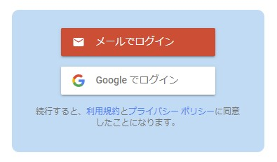

## firebase のメモ

### 目次

<menu>

- [CDN（インストール）](#cdn（インストール）)
- [firebaseの初期化](#firebaseの初期化)
- [firebase UI の初期化](#firebase-ui-の初期化)
- [ログインの確認](#ログインの確認)

</menu>

### 前提

まず、firebaseのプロジェクトを作成しておいてください。それと、使う機能を使えるようにしておいてください。

主な機能は以下の通りです。

| 機能名                     | 詳細                                                                                                      |
|----------------------------|-----------------------------------------------------------------------------------------------------------|
| Authentication             | パスワード、電話番号、プロバイダ（Google、Facebook、Twitter）などを使用した認証を行うことができる         |
| Realtime Database          | JSON形式のデータを持つクラウドホスト型データベース、リアルタイムの同期が可能                              |
| Cloud Firestore            | Firebase と Google Cloud からのモバイル、ウェブ、サーバー開発に対応した、柔軟でスケーラブルなデータベース |
| Cloud Storage for Firebase | 画像、音声、動画、またはその他のユーザーが生成したコンテンツを格納する場合に使用できる                    |
| Firebase Hosting           | デベロッパー向けの、本番環境レベルのウェブ コンテンツ ホスティング                                        |

今回は、Authenticationを使います。

#### 引用
> [Firebase Authentication](https://firebase.google.com/docs/auth?hl=ja)\
> [Firebase Realtime Database](https://firebase.google.com/docs/database?hl=ja)\
> [Cloud Firestore  |  Firebase Documentation](https://firebase.google.com/docs/firestore?hl=ja)\
> [Cloud Storage for Firebase](https://firebase.google.com/docs/storage?hl=ja)\
> [Firebase Hosting](https://firebase.google.com/docs/hosting?hl=ja)

### CDN（インストール）

CDNで読み込む場合は、`<head>`タグに入力することで使用することが出来ます。

firebase UI は、ログインボタンなどの必要な機能を簡単に使うことが出来るライブラリです。

```html
<!-- firebase -->
<!-- 必要な機能だけインポートする -->
<script src="https://www.gstatic.com/firebasejs/9.1.2/firebase-app-compat.js"></script>
<script src="https://www.gstatic.com/firebasejs/9.1.2/firebase-auth-compat.js"></script>

<!-- firebase ui -->
<script src="https://www.gstatic.com/firebasejs/ui/5.0.0/firebase-ui-auth__ja.js"></script>
<link type="text/css" rel="stylesheet" href="https://www.gstatic.com/firebasejs/ui/5.0.0/firebase-ui-auth.css" />
```

### firebaseの初期化

firebaseの構成オブジェクトは、「プロジェクト > 設定 > プロジェクトの設定」から取得することが出来ます。

```js
// firebase の構成オブジェクト
const firebaseConfig = {
  apiKey: "xxxxxxxxxxxxxxxxxxxxxxxxxxxxxx",
  authDomain: "xxxxxxxxxxxxxxx.firebaseapp.com",
  databaseURL: "https://xxxxxxxxxxxxxxxxxxxx.firebaseio.com",
  projectId: "xxxxxxxxxxxxxxxxxxxxx",
  storageBucket: "xxxxxxxxxxxxxxxxxxxx.appspot.com",
  messagingSenderId: "00000000000",
  appId: "xxxxxxxxxxxxxxxxxxxxxxxxxxxxxxx",
  measurementId: "X-XXXXXXXXXX"
};

// firebase の初期化
firebase.initializeApp(firebaseConfig);
```

### firebase UI の初期化

firebase UI を用いることでログイン画面のインタフェースを簡単に作成することが出来ます。

`firebase.auth()`を引数として`firebaseui.auth.AuthUI`クラスでインスタンスを生成します。ここでは`ui`とする。`ui.start`の第一引数に表示する要素の`id`、第二引数に設定を指定して実行します。

メールリンク認証を行う場合は`signInMethod`に`EMAIL_LINK_SIGN_IN_METHOD`を指定します。

```js
// firebase UI の設定
const uiConfig = {
  signInSuccessUrl: './result.html',
  signInOptions: [
    {
      provider: firebase.auth.EmailAuthProvider.PROVIDER_ID,
      // アカウント作成時にログインメールを送信するオプションを指定
      signInMethod: firebase.auth.EmailAuthProvider.EMAIL_LINK_SIGN_IN_METHOD,
      forceSameDevice: false
    },
    firebase.auth.GoogleAuthProvider.PROVIDER_ID,
    //firebase.auth.FacebookAuthProvider.PROVIDER_ID,
    //firebase.auth.TwitterAuthProvider.PROVIDER_ID,
    //firebase.auth.GithubAuthProvider.PROVIDER_ID,
    //firebase.auth.PhoneAuthProvider.PROVIDER_ID,
    //firebaseui.auth.AnonymousAuthProvider.PROVIDER_ID
  ],
  tosUrl: './tos.html',
  privacyPolicyUrl: function () {
    window.location.assign('./privacyPolicyUrl.html');
  }
}

// firebase UI の実行
const ui = new firebaseui.auth.AuthUI(firebase.auth());
ui.start('#firebaseui-auth-container', uiConfig);
```

実行した画像



基本的なプロパティは以下の方の通りです。

| プロパティ         | 説明                                                                                               |
|:-------------------|:---------------------------------------------------------------------------------------------------|
| `signInSuccessUrl` | ログイン成功時にリダイレクトするURL                                                                |
| `signInOptions`    | ログインするプロバイダの指定<br>オブジェクトに`provider`と`signInMethod`等のオプションを指定できる |
| `tosUrl`           | Terms of Service（利用規約）のページURL（任意）                                                    |
| `privacyPolicyUrl` | プライバシーポリシーのページURL（任意）                                                            |

詳しくは、[FirebaseUI for Web — Auth](https://github.com/firebase/firebaseui-web)を参照してください。


### ログインの確認

ユーザーの情報は、`currentUser`から取得できます。

`onAuthStateChanged`というイベントハンドラを用いることで認証状態が変化した場合に発火し、その度にログインされているか確認することが出来ます。

引数として与えられた`user`が空（`null`）かどうかでログインされているかどうかを確認できます。

```js
// まず初期化する
const firebaseConfig = {
  apiKey: "xxxxxxxxxxxxxxxxxxxxxxxxxxxxxx",
  authDomain: "xxxxxxxxxxxxxxx.firebaseapp.com",
  databaseURL: "https://xxxxxxxxxxxxxxxxxxxx.firebaseio.com",
  projectId: "xxxxxxxxxxxxxxxxxxxxx",
  storageBucket: "xxxxxxxxxxxxxxxxxxxx.appspot.com",
  messagingSenderId: "00000000000",
  appId: "xxxxxxxxxxxxxxxxxxxxxxxxxxxxxxx",
  measurementId: "X-XXXXXXXXXX"
};
firebase.initializeApp(firebaseConfig);

// 認証状態が変更されると呼び出される
firebase.auth().onAuthStateChanged(function (user) {
  // user が存在する --> ログインされている
  if (user) {
    alert(`ログインしました\n${user.displayName}さんこんにちは`);
  }
  // user が存在しない --> ログインされていない
  else {
    alert("ログインされていません\nログイン画面にリダイレクトします");
    location.href = "./login.html";
  }
});
```

実行結果


### 参照

> [FirebaseUI for Web — Auth](https://github.com/firebase/firebaseui-web)\
> [Firebase でユーザーを管理する](https://firebase.google.com/docs/auth/web/manage-users?hl=ja)
