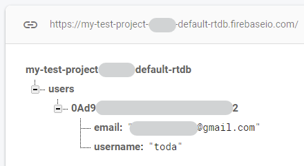
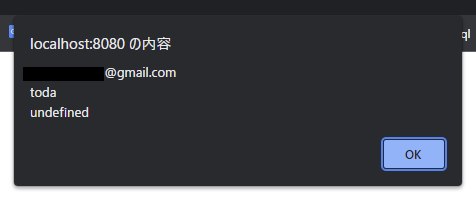
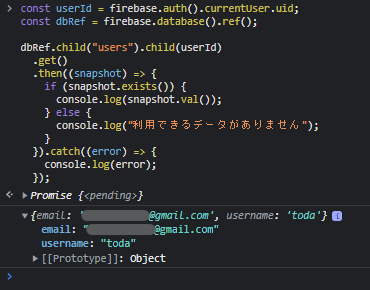

# firebaseメモ（realtime database）

<menu>

- [CDN](#cdn)
- [ルールの設定](#ルールの設定)
- [firebaseの初期化](#firebaseの初期化)
- [databaseのインスタンスの作成](#databaseのインスタンスの作成)
- [データの参照](#データの参照)
- [データの書き込み](#データの書き込み)
- [データを読み取る](#データを読み取る)
- [データの更新・削除](#データの更新・削除)
- [参照](#参照)

</menu>


## CDN

使用する機能をインポートします。

今回は認証とデータベースを用います。

```html
<!-- firebase -->
<!-- 必要な機能だけインポートする -->
<script src="https://www.gstatic.com/firebasejs/9.1.2/firebase-app-compat.js"></script>
<script src="https://www.gstatic.com/firebasejs/9.1.2/firebase-auth-compat.js"></script>
<!-- realtime database -->
<script src="https://www.gstatic.com/firebasejs/9.1.2/firebase-database-compat.js"></script>
```

## ルールの設定

Realtime Database のセキュリティルールは以下の4つがあります。

| ルールの種類 | 説明                                                                           |
|:-------------|:-------------------------------------------------------------------------------|
| `.read`      | ユーザーによるデータの読み取りを許可するときに記述します。                     |
| `.write`     | ユーザーによるデータの書き込みを許可するときに記述します。                     |
| `.validate`  | 値の適切なフォーマット方法、子属性を持つかどうか、およびデータ型を定義します。 |
| `.indexOn`   | インデックスを作成する子に並べ替えとクエリをサポートするように指定します。     |

データベース内のデータに対する認証したユーザーのアクセス権を制御する方法が必要になります。これをRealtime Database セキュリティ ルールによって、ユーザーごとにアクセス権を制御することが出来ます。

以下の場合は、あらゆるユーザーがパス`/foo/`を読み取ることが出来ますが、書き込むことが出来ません。

```json
{
  "rules": {
    "foo": {
      ".read": true,
      ".write": false
    }
  }
}
```

この場合、`/foo/`にあるデータのアクセス権を付与するだけでなく、`/foo/bar/baz/`のようなより深いパスにあるデータの読み取りアクセス権も付与します。また、データベース内の浅いパスにある`.read`や`.write`のルールは、深いパスにあるルールよりも優先させるため、`/foo/bar/baz/`のルールが`false`と評価されても`/foo/bar/baz/`のアクセス権を許可します。

このルールには、組み込み変数と関数が含まれており、他のパス、サーバー側のタイムスタンプ、認証情報などを参照できます。この組み込み変数を用いて、認証ユーザーに`users/<uid>/`への書き込みアクセス権を付与するルールの例を以下に示します。ここで &lt;uid&gt; は、Firebase Authentication によって取得されたユーザーの ID です。

```json
{
  "rules": {
    "users": {
      "$uid": {
        ".write": "$uid === auth.uid"
      }
    }
  }
}
```

今回使用するルールは以下の通りにします。

```json
{
  "rules": {
    "users": {
      "$uid": {
        ".read": "auth != null && auth.uid === $uid",
        ".write": "$uid === auth.uid"
      }
    }
  }
}
```


ユーザーデータの読み込みは、認証されたユーザーが存在する場合かつ、ユーザーIDと認証されたユーザーIDが一致する場合に許可します。

ユーザーデータの書き込みは、データベースのユーザーIDと認証されたユーザーIDが一致する場合にのみ許可します。

### 引用
> [Firebase Realtime Database ルールについて  |  Firebase Documentation](https://firebase.google.com/docs/database/security?hl=ja)\
> [リアルタイムデータベースルールの使用条件  |  Firebase Documentation](https://firebase.google.com/docs/database/security/rules-conditions?hl=ja)

## firebaseの初期化

firebaseの機能を使用するため、firebaseの初期化を行います。

```js
// firebase の構成オブジェクト
const firebaseConfig = {
  apiKey: "xxxxxxxxxxxxxxxxxxxxxxxxxxxxxx",
  authDomain: "xxxxxxxxxxxxxxx.firebaseapp.com",
  databaseURL: "https://xxxxxxxxxxxxxxxxxxxx.firebaseio.com",
  projectId: "xxxxxxxxxxxxxxxxxxxxx",
  storageBucket: "xxxxxxxxxxxxxxxxxxxx.appspot.com",
  messagingSenderId: "00000000000",
  appId: "xxxxxxxxxxxxxxxxxxxxxxxxxxxxxxx",
  measurementId: "X-XXXXXXXXXX"
};

// firebase の初期化
firebase.initializeApp(firebaseConfig);
```

## databaseのインスタンスの作成

データベースでデータの読み書きを行うには、インスタンスを作成します。

```js
let database = firebase.database();

// もしくは
firebase.database()
// から読み書きを行う
```

## データの参照

`ref`メソッドを用いて参照するデータの階層を選択します。

```js
let database = firebase.database();
// 例）users/user1 にアクセスする場合
database.ref("users/user1")

// この後に .set や .on .get などのメソッドで読み書きを行う
```

また、以下のような書き方もできます。

```js
let database = firebase.database();

// child() を用いてパスを指定できる
database.ref().child("users").child("user1")
```

## データの書き込み

`set`メソッドを用いてデータの書き込みを行うことが出来ます。

```js
let user = firebase.auth().currentUser;

firebase.database()
  .ref("users/" + user.uid)
  .set({
    username: user.displayName,
    email: user.email,
    profile_picture: user.photoURL
  });
```

データが格納されているかを確認します。



しっかりとデータが格納されているのが確認できますね。

ちなみに、データベースに`profile_picture`がないのは、`user.photoURL`が`null`であるからだと思います。

## データを読み取る

### `on`, `once`

パスにあるデータを読み取ってデータ更新を検知するには、`ref()`の後に`on()`メソッドまたは`once()`メソッドを使用してイベントを監視します。

第一引数にイベント名、第二引数に実行する関数を入力します。イベント名には、`value`を使用できます。

この`value`イベントは、特定のパスにあるコンテンツ（データ）の静的スナップショットを、イベントの発生時の存在していたとおりに読み取ることが出来ます。

`on()`メソッドは、イベントが登録されたときに1回実行されます。イベントのコールバックには、その場所（参照）にあるすべてのデータ（子のデータも含む）を含んだスナップショットが渡されます。

データが存在しない場合、スナップショットから渡されるのは、`exists()`を呼び出した場合は`false`、`val()`を呼び出した場合は`null`です。

以下の例は、宣言時とデータベースの変更を検知した時に実行されます。

```js
let user = firebase.auth().currentUser;

firebase.database()
  .ref("users/" + user.uid)
  .on("value", function(snapshot) {
    const data = snapshot.val();
    alert(`${data.email}\n${data.username}\n${data.profile_picture}`);
  });
```

実行結果は以下のようになります。



### `get`

`get()`はデータを一回読み取ることが出来ます。

通常は、データを読み取り、バックエンドからデータの更新に関する通知を受け取るには、上記の値イベント手法（`on()`, `once()`）を使用する必要があります。

データが 1 回だけ必要な場合は、`get()`を使用してデータベースからデータのスナップショットを取得します。

`get()`を必要以上に使用すると、帯域幅の使用が増加し、パフォーマンスの低下を招くおそれがあります。ただし、上記のリアルタイム リスナーを使用することで、これを回避できます。

```js
const userId = firebase.auth().currentUser.uid;
const dbRef = firebase.database().ref();

dbRef.child("users").child(userId)
  .get()
  .then((snapshot) => {
    if (snapshot.exists()) {
      console.log(snapshot.val());
    } else {
      console.log("利用できるデータがありません");
    }
  }).catch((error) => {
    console.log(error);
  });
```

実行結果は以下のようになります。



## データの更新・削除

### 更新

他の子ノードを上書きすることなく、ノードの特定の複数の子に同時に書き込むには、`update()`メソッドを使用します。

```js
const userId = firebase.auth().currentUser.uid;

let updates = {};
updates["/users/"+ userId +"/username"] = "example";

firebase.database().ref().update(updates);
```

### 削除

データを削除する最も簡単な方法は、そのデータの場所への参照の`remove()`を呼び出すことです。

また、他の書き込みオペレーション（`set()`や`update()`など）の値として`null`を指定する方法でも削除できます。この方法と`update()`を併用すると、APIを1回呼び出すだけで複数の子を削除できます。

以下のコードはユーザーの`username`を削除する例です。

```js
const userId = firebase.auth().currentUser.uid;

// remove
firebase.database()
  .ref()
  .child("users")
  .child(userId)
  .child("username")
  .remove();

// set or update
firebase.database()
.ref()
  .child("users")
  .child(userId)
  .child("username")
  .set(null);
```

## 参照

> [Firebase Realtime Database ルールについて  |  Firebase Documentation](https://firebase.google.com/docs/database/security?hl=ja)\
> [リアルタイムデータベースルールの使用条件  |  Firebase Documentation](https://firebase.google.com/docs/database/security/rules-conditions?hl=ja)\
> [ウェブでのデータの読み取りと書き込み  |  Firebase Realtime Database](https://firebase.google.com/docs/database/web/read-and-write?hl=ja)
