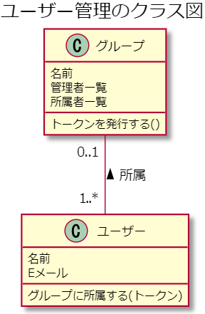

# データベースの作成案など

考えのメモや発表の資料として、書き留めます。

## グループ追加をする方法案

### すべてのグループをリスト化してユーザーに表示する

一番グループ追加の手間のかからない方法。

ただ、部外者や悪意のある人の追加を防ぐことができない点が問題。

### Google classroom のような方法

Google classroom では、グループの担当者（ホスト）がユーザーに追加用の ID を教えて、その ID を入力させることでグループ追加を行います。

この方法を使えば、部外者や悪意のある人の追加を防ぐことが出来る。

ID を伝える必要があるため、追加するのに多少の手間がかかるのが難点。

<details>
  <summary>現在考えているデータベース案（11月25日）</summary>

```json
{
  "users": {
    "<User ID>": {
      "name": "戸田",
      "email": "sample@example.com",
      "group": "<group ID>"
    },
    "..."
  },

  "groups": {
    "<Group ID>": {
      "name": "情報物理研究室",
      "admins": {
        "<User ID>": true,
        "<User ID>": false,
      },
      "members": {
        "<User ID>": true,
        "<User ID>": true
      }
    },
    "..."
  },

  "logs": {
    "<Application Name>": {
      "<User ID>": {
        "<Log ID>": {
          "startTime": 1234567890,
          "endTime": 2345678901,
          "operations": {
            "<Time Stamp Number>" : 0,
            "<Time Stamp Number>" : 4,
            "<Time Stamp Number>" : 3
          }
        }
      }
    },
    "<Application Name>": {
      "..."
    }
  }
}
```

ID 等の可変する文字列は`< >`で表現している。

ログは、各アプリケーションごとに分割している。<br>
ログは、各ユーザーごとに分別し、乱数で生成された文字列の ID として保存する。

### ユーザーとグループのクラス図

- ユーザーは 1 つのグループに所属する
- グループは 1 人以上のユーザーが所属する



</details>

<details>
  <summary>現在考えているデータベース案（11月1日）</summary>

```json
{
  "groups": {
    "team-xxxx": {
      "name": "Sample Team",
      "members": {
        "user-xxxx": {
          "questions": {
            "question-1": true
          },
          "history": ["question-1"]
        },
        "user-yyyy": {
          "questions": {
            "question-1": true,
            "question-3": true
          },
          "history": ["question-3", "question-1"]
        }
      }
    }
  },
  "users": {
    "user-yyyyy": {
      "name": "Toda",
      "email": "example@example.com",
      "groups": {
        "team-xxxx": true
      }
    },
    "user-yyyyy": {}
  },
  "questions": {}
}
```

`users`内に問題の実施について記述すると、グループの管理者（リーダー）から、見ることができない。<br>
そのため、`groups`内に問題を実施したかを記録する。また、履歴も`groups`内に記録しようと考えている。

`questions`については現在のところ不要

</details>

<details>
  <summary>現在考えているデータベース案（10月28日）</summary>

グループとユーザーの両方のデータを分けて作成しています。

```json
{
  "groups": {
    "team-xxxx": {
      "name": "Sample Team",
      "members": {
        "XXXXXXXX": true,
        "YYYYYYYY": false
      }
    }
  },
  "users": {
    "XXXXXXXX": {
      "name": "Toda",
      "email": "example@example.com",
      "groups": {
        "team-xxxx": true
      }
    },
    "YYYYYYYY": {}
  }
}
```

特徴としては、データを非正規化して、ネストを深くならないようにしています。理由としては、以下の 2 つが挙げられます。

- 特定の場所にあるデータを読み込むと、その子ノードもすべて取り込んでしまうため（効率が悪くなる）
- firebase Realtime Database の特性上、ネストを深くするとルール設定が複雑になってしまうため

また、ユーザーとグループの双方向の関係であるため、ユーザーが所属しているグループをリスト化してそれらのグループの情報を読み込む方法を取っています。

以下の公式ドキュメントを参考に作成をしました。

> [データベースの構造化  |  Firebase Documentation](https://firebase.google.com/docs/database/web/structure-data?hl=ja)

</details>

## ID の自動作成

`add()`または`.doc().set()`を用いて自動作成した ID 名を持つデータ下に指定したデータを入力する。

```js
db.collection("cities").add({
  name: "Tokyo",
  country: "Japan",
});
```

```js
db.collection("cities").doc().set({
  name: "Tokyo",
  country: "Japan",
});
```

### 引用

> [【Firestore】ドキュメントの自動生成 ID って被らないの？ - Qiita](https://qiita.com/yukin01/items/dcac3366adcf0fe827a3)\
> [firebase realtime database でよく使う rule - Qiita](https://qiita.com/mironal/items/b93742e8ef72b3268beb)
