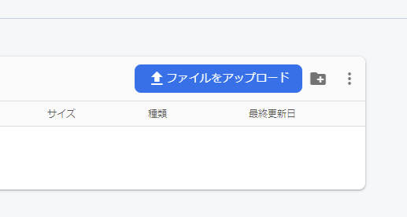
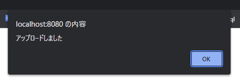
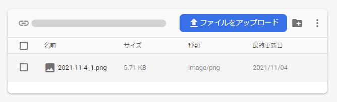
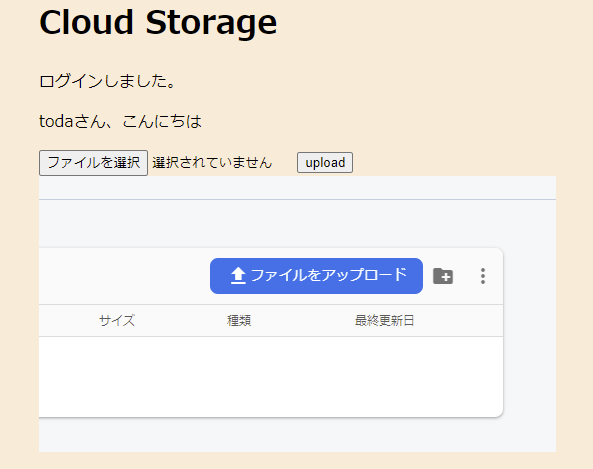
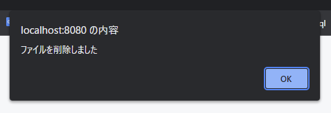
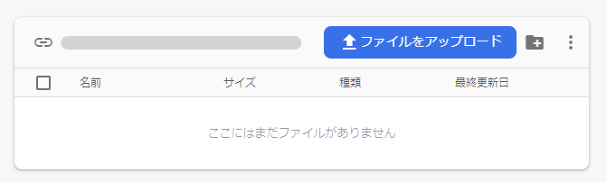
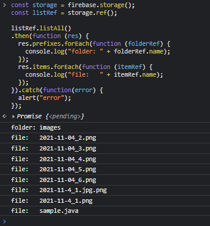

# firebaseメモ（Cloud Storage）

3コマ漫画の画像をどうするかについて話し合った結果、方法の1つとして、FirebaseのCloud Storageを試してみることにしました。

<menu>

- [CDN](#cdn)
- [初期化](#初期化)
- [storageのインスタンスの作成、完全パス](#storageのインスタンスの作成、完全パス)
- [ファイルのアップロード](#ファイルのアップロード)
- [ファイルのダウンロード](#ファイルのダウンロード)
- [ファイルの削除](#ファイルの削除)
- [ファイルリストの取得](#ファイルリストの取得)
- [まとめ](#まとめ)
- [参照](#参照)

</menu>

## CDN

使用する機能をインポートします。

今回は認証とストレージを用います。

```html
<!-- firebase -->
<!-- 必要な機能だけインポートする -->
<script src="https://www.gstatic.com/firebasejs/9.1.2/firebase-app-compat.js"></script>
<script src="https://www.gstatic.com/firebasejs/9.1.2/firebase-auth-compat.js"></script>
<!-- cloud storage -->
<script src="https://www.gstatic.com/firebasejs/9.1.2/firebase-storage-compat.js"></script>
```

## 初期化

firebaseの機能を使用するため、firebaseの初期化を行います。

```js
// firebase の構成オブジェクト
const firebaseConfig = {
  apiKey: "xxxxxxxxxxxxxxxxxxxxxxxxxxxxxx",
  authDomain: "xxxxxxxxxxxxxxx.firebaseapp.com",
  databaseURL: "https://xxxxxxxxxxxxxxxxxxxx.firebaseio.com",
  projectId: "xxxxxxxxxxxxxxxxxxxxx",
  storageBucket: "xxxxxxxxxxxxxxxxxxxx.appspot.com",
  messagingSenderId: "00000000000",
  appId: "xxxxxxxxxxxxxxxxxxxxxxxxxxxxxxx",
  measurementId: "X-XXXXXXXXXX"
};

// firebase の初期化
firebase.initializeApp(firebaseConfig);
```

## storageのインスタンスの作成、完全パス

storageのインスタンスは、`.storage()`で作成します。

```js
// ストレージのインスタンスの作成
const storage = firebase.storage();
```

ファイルをダウンロードする際などには、そのファイルの**完全パス**を指定する必要があります。その完全パスの指定方法は、以下の通りです。

```js
// ストレージの参照（パス）
// ルート
storage.ref()

// ルート下のファイル
storage.ref("image.jpg")

// フォルダ
storage.ref().child("images")

// フォルダ内のファイル
storage.ref().child("images").child("image.jpg")
```

## ファイルのアップロード

### 直接アップロードする場合

**コンソール > Storage > Files**の画面に「**ファイルをアップロード**」というボタンがあるのでそこから画像をアップロードできます。



### JavaScriptでアップロードする場合

アップロードは、`.put()`を用います。指定した参照で`put`メソッドを実行できます。`put`の引数には、`File`もしくは`Blob`、`Unit8Array`形式でファイルを入力します。

`put`は、`Promise`が返されるため、`.then`でその後の処理を記述することが出来ます。

- **HTML**

```html
<input type="file" id="upload-file">
<button id="upload-button">upload</button>
```

- **JavaScript**

```js
document.getElementById("upload-button")
  .addEventListener("click", function () {
    // storageインスタンスの作成
    const storage = firebase.storage();
    // アップロードするファイル(Fileオブジェクト)
    const file = document.getElementById("upload-file").files[0];

    if (file) {
      // 参照の作成
      const ref = storage.ref().child(file.name);

      // putメソッドででアップロードする
      ref.put(file)
        .then(function (snapshot) {
          alert("アップロードしました");
        });
    }
  });
```

実行結果



実行後のコンソール画面



## ファイルのダウンロード

### URL経由でデータをダウンロードする

ファイルのダウンロードURLを取得するには、ストレージ参照で`getDownloadURL()`メソッドを呼び出します。

画像を`img`タグに表示する方法は以下の通りです。

- **HTML**

```html

```
- **JavaScript**

```js
const storageRef = firebase.storage().ref();
let fileName = "image.jpg"

storageRef.child(fileName)
  .getDownloadURL()
  .then(function(url) {
    // 引数の `url` は、image.jpgのダウンロードURLです。

    let img = document.getElementById("my-image");
    img.src = url;
  });
```

実行結果



<details>
<summary>補足：ダウンロードする場合</summary>

`xhr`や`fetch`でダウンロードする場合、**CORSを有効にする必要があります**。

- **JavaScript**（CORS設定をしないとエラーになる）

```js
const storageRef = firebase.storage().ref();
let fileName = "image.jpg"

storageRef.child(fileName)
  .getDownloadURL()
  .then(function(url) {
    // 引数の `url` は、image.jpgのダウンロードURLです。

    let xhr = new XMLHttpRequest();
    xhr.responseType = 'blob';
    xhr.onload = function(event) {
      let blob = xhr.response;
    };
    xhr.open('GET', url);
    xhr.send();
  });
```

</details>

## ファイルの削除

ファイルを削除するには、まずそのファイルの参照を作成します。次に、その参照で `delete()`メソッドを呼び出します。

```js
const storage = firebase.storage();
const desertRef = storage.ref().child("image.jpg");

desertRef.delete()
  .then(function () {
    alert("ファイルを削除しました")
  })
  .catch(function (error) {
    alert(error);
  });
```

実行結果



実行後のコンソール



## ファイルリストの取得

すべてのファイルリストを取得する場合は`listAll()`、個数などで分割して取得する場合は`list()`メソッドを用います。

```js
const storage = firebase.storage();
const listRef = storage.ref();

listRef.listAll()
.then(function (res) {
  res.prefixes.forEach(function (folderRef) {
    console.log("folder: " + folderRef.name);
  });
  res.items.forEach(function (itemRef) {
    console.log("file:   " + itemRef.name);
  });
}).catch(function(error) {
  alert("error");
});
```

実行結果



## まとめ

フォルダで管理できる点や、アップロード自体にそこまで問題が発生しなかった点は良いと思います。`img`タグで表示出来る点も大きかったと感じています。

ただ、ストレージを管理する人をルールで指定する方法や、CORS設定を変更しないとデータをダウンロードできない点は難点だと感じました。

## 参照

> [ウェブでストレージ参照を作成する  |  Firebase](https://firebase.google.com/docs/storage/web/create-reference)\
> [ウェブでファイルをアップロードする  |  Firebase](https://firebase.google.com/docs/storage/web/upload-files)\
> [ウェブでファイルをダウンロードする  |  Firebase](https://firebase.google.com/docs/storage/web/download-files)\
> [ウェブでファイルを削除する  |  Firebase](https://firebase.google.com/docs/storage/web/delete-files)\
> [ウェブでファイルのリストを取得する  |  Firebase](https://firebase.google.com/docs/storage/web/list-files)
