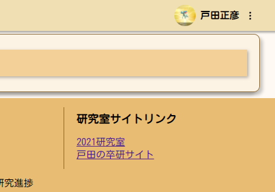

# 実装案のメモ

## 「このアプリケーションについて」のページを作成する

アプリケーション紹介ページ・目的ページは必要。

例：感情をコントロールするためには認知を知ることが肝要

## ユーザー情報ページのアップデート

例

- [https://zenn.dev/](https://zenn.dev/)

## グループ機能の追加

ユーザーがグループに対して加入申請を送る。

グループ管理者が加入申請を処理する。

## ログの追加

ユーザーの行ったことを記録する。

試行錯誤しながらデータの構造を決める方針。

## コンテンツの保存

heteml サーバーに保存してそこから読み込む

- [x] 何個コンテンツがあるかを返す API を作ると動的にページを生成できる

## アイコン案

### caret down （下三角）

### 3 つのドット

