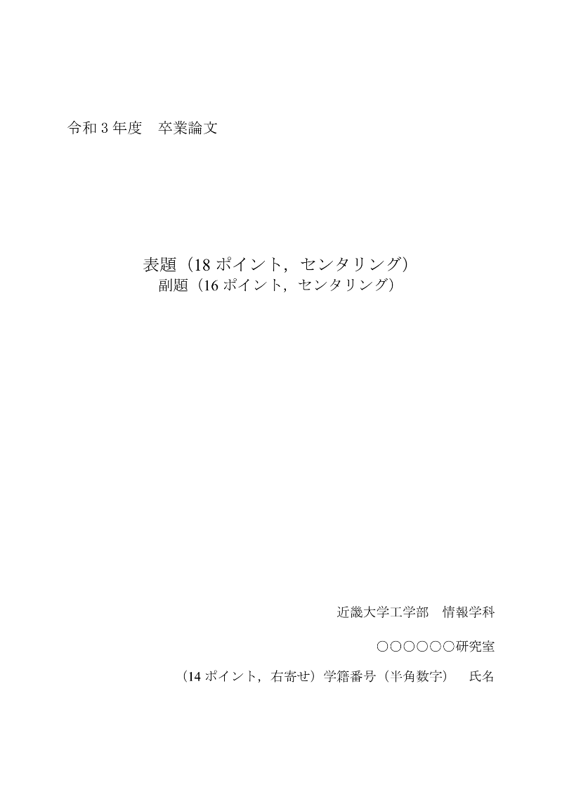

# 卒業論文の構成メモ

<menu>

**おおまかな構成**

1. [タイトル（表紙）](#1ページ目「タイトル」)
2. [目次](#2ページ目「目次」)
3. [研究の目的と背景](#本文「研究の目的や背景」)
4. [使用技術](#本文「使用技術」)
5. [研究の内容(アプリの構成・動作)](#本文「研究の内容（アプリの構成・動作など）」)
6. [まとめ（結論）](#まとめ)
7. [謝辞](#謝辞)
8. [参考文献](#参考文献)

</menu>

## 留意点

論文を作成する上で大切な点は、**参考にした情報ソースは必ず残す**こと。

後から調べなおすのは地獄の作業なので、URLは残しておく。

<details>
<summary>2021年度卒業論文書式の内容</summary>

### 本文

| 項目 | 要件 |
| :-- | :-- |
| ソフトウェア | MS-Word |
| 用紙サイズ | A4 |
| 余白 | 上下左右25mm |
| 全角フォント | MS明朝 |
| 半角フォント | _Times New Roman_ |
| 英数字 | 半角 |
| 文字サイズ | 10.5ポイント |
| 文字数 | 10,000 文字以上（本文のみ、表紙・目次・図表・参考文献は含まない） |
| 句読点 | 「．」「，」（全角） |

</details>

## 1ページ目「タイトル」

- 左上に年度と「卒業論文」
- 中央にタイトル
- 右下に名前など

> 近畿大学工学部　情報学科\
> 情報物理研究室\
> 1810990019　戸田　正彦

<details>
<summary>表紙の例</summary>



</details>

## 2ページ目「目次」

`1.`、`2.1`、`2.2.1`などで区切って目次を書く

### 例

```
1. 研究の背景と目的
  1.1 背景
  1.2 高次機能障害
    1.2.1 ...

2. 研究内容
  2.1 ...
```

ページ番号を振るのもあり。

```
1. 研究の背景と目的       ・・・ 1

2. 研究内容              ・・・ 3
```

## 本文「研究の目的や背景」

研究の目的や前提、誰のための研究開発なのかを明確にする。

- なぜその研究をするに至ったのか（背景・経緯）
- その研究のテーマについての説明（高次機能障害・認知行動療法とは何なのか？）
- 本システムの目的
- 研究の協力者（心理学の教授とか）

> 情報物理研究室では、月に一度、広島県立リハビリテーション・高次機能センターの職員の方と心理学教授とともに心理学ミーティングを開いている。...（2019年論文から一部抜粋）

## 本文「使用技術」

おもに使用した技術（ライブラリやフレームワーク）を細かく紹介する。自分の場合だとVue.jsライブラリやFlickingなど。

それぞれの技術についてどのような特徴や何のためにその技術を用いたのかなどを説明する。

> 2.1 JavaScript\
> JavaScript はウェブページにて動作するプログラミング言語であり，本研究の主要開発言語である．\
>\
> 2.1.1 Vue.js\
> Vue.js（ヴュー・ジェイエス）またはVueは、Evan Youが開発した，Webアプリケーションにおけるユーザーインターフェイスを構築するための，オープンソースのJavaScriptフレームワークである．Vue.jsの最大の特徴は、控えめなリアクティブシステムという点である．データ変更を検知して表示を反映させることが出来る．\
>\
> 2.1.2 Vue CLI\
> 本研究では，コマンドラインインタフェースであるVueCLIを用いて，高機能なシングルページアプリケーション（SPA）を構築している．

### 参照

> [JavaScript とは - ウェブ開発を学ぶ | MDN](https://developer.mozilla.org/ja/docs/Learn/JavaScript/First_steps/What_is_JavaScript)\
> [Vue.js - Wikipedia](https://ja.wikipedia.org/wiki/Vue.js)

## 本文「研究の内容（アプリの構成・動作など）」

## まとめ

研究を通して得た結論。

## 謝辞

研究を手伝ってい頂いた教授に感謝の思いを伝えます。

## 参考文献

論文で引用した文献のリストや引用日付などをつける。

### 例

> [1] 情報物理卒研サイト (2022/12/20)\
>     https://buturi.heteml.net/student/2021/
